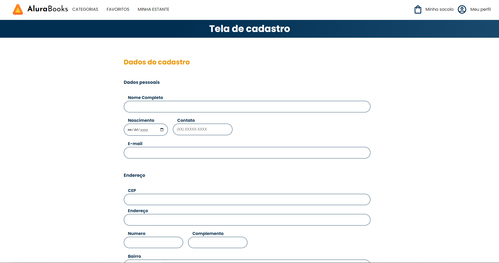

# js-consumindo-dados-api
Repositório do treinamento "JavaScript: Consumindo e tratando dados de uma API" da Alura Cursos Online.

<h2 align='center'> Imagem do projeto </h2>



```
projeto finalizado 
```

<h2>Clique no link:</h2>

>https://api-com-js.vercel.app/